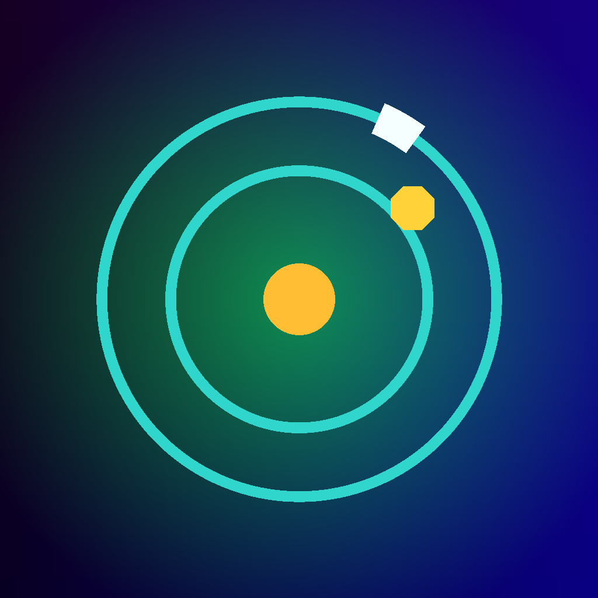

# Orbit Sprint

<p align="center">
  
</p>

<p align="center">
  <strong>One-touch orbit arcade game for iOS</strong><br>
  Switch lanes, collect sparks, survive pressure, and chase a cleaner run.
</p>

<p align="center">
  
  
  
  
</p>

## Overview

Orbit Sprint is a fast, minimal arcade game built with SwiftUI and SpriteKit. The player controls a runner moving around circular lanes, switching between the inner and outer orbit with a single tap.

The core loop is simple to learn but designed to grow in pressure: collect sparks, avoid shards, build combos, protect runs with shields, and use slow-time moments to survive longer.

## Key Features

- One-touch lane switching built for quick mobile sessions
- Increasing difficulty with level progression
- Combo and multiplier system for score-chasing
- Shield and slow-time power-ups for strategic recovery
- Persistent best score
- Sound effects and haptic feedback with settings toggles
- Korean and English localization
- First-run tutorial and replayable help flow
- Privacy manifest included for App Store preparation

## Gameplay

Tap anywhere to switch orbit lanes.

Collect yellow sparks to score points and build combo momentum. Avoid red shards, unless you have a shield ready. As your level rises, the game becomes faster and denser, forcing cleaner timing and better risk decisions.

## Tech Stack

- Swift
- SwiftUI
- SpriteKit
- AVFoundation
- UIKit haptics
- Xcode iOS project

## Project Structure

```text
OrbitSprint/
  OrbitSprint.xcodeproj/
  OrbitSprint/
    ContentView.swift
    GameScene.swift
    GameState.swift
    GameTheme.swift
    Haptics.swift
    SoundPlayer.swift
    PrivacyInfo.xcprivacy
    ko.lproj/
    en.lproj/
    Assets.xcassets/
    Sounds/
```

## Run Locally

1. Open `OrbitSprint/OrbitSprint.xcodeproj` in Xcode.
2. Select the `OrbitSprint` scheme.
3. Choose an iPhone simulator or a connected iPhone.
4. Press Run.

For physical device testing, make sure Developer Mode is enabled on the iPhone and a development team is selected in Xcode Signing & Capabilities.

## Localization

Orbit Sprint currently supports:

- Korean
- English

iOS will automatically use the best matching language based on the user's device language settings.

## App Store Preparation

Current preparation items:

- Bundle identifier configured as `com.junpacstudio.orbitsprint`
- Korean and English app display names included
- Privacy manifest included
- Basic sound, haptics, tutorial, and settings flows implemented

Before release:

- Replace the temporary app icon with a final production icon
- Prepare App Store screenshots
- Write Korean and English App Store metadata
- Complete privacy questionnaire in App Store Connect
- Test difficulty balance on real devices
- Add more progression, missions, achievements, and polish

## Roadmap

- Daily missions and reward streaks
- Unlockable skins and orbit themes
- More obstacle patterns and power-up types
- Game Center leaderboard support
- Achievement system
- Improved onboarding and App Store-ready screenshots
- More sound polish and music options

## Korean Summary

Orbit Sprint는 SwiftUI와 SpriteKit으로 만든 원터치 iOS 아케이드 게임입니다. 플레이어는 안쪽/바깥쪽 궤도를 전환하며 스파크를 모으고 장애물을 피합니다.

단순한 조작 위에 콤보, 배수 점수, 보호막, 슬로우 타임, 점진적 난이도를 얹어 짧지만 반복해서 도전하고 싶은 모바일 게임을 목표로 개발 중입니다.

## License

This project is currently private/proprietary unless a license is added later.
